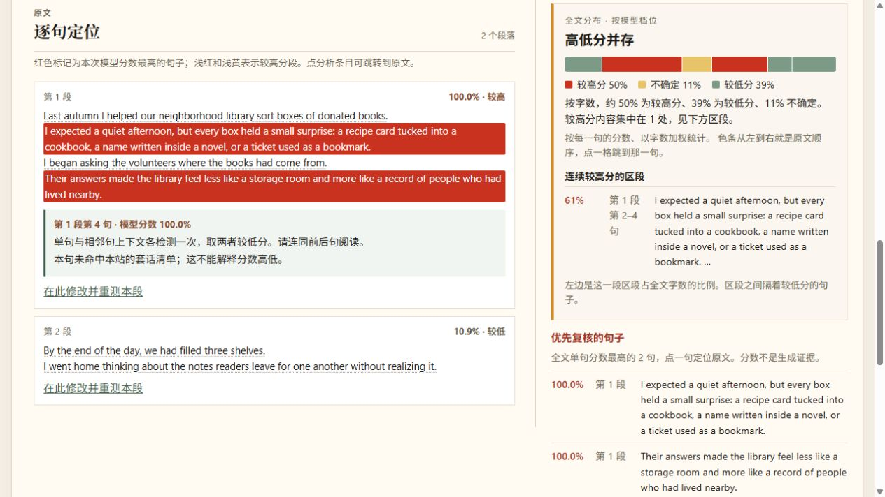

<div align="center">
  
  <h1>作文 AI 写作检测</h1>
  <p>在本机查看中英文文本的模型评分，并逐句检查值得复核的段落。</p>
  <p><strong>本地预览 · 尚未部署在线服务 · 分数尚未校准</strong></p>
  <p>
    <a href="docs/README.en.md">English</a> ·
    <a href="#快速开始">快速开始</a> ·
    <a href="docs/benchmark.md">评测说明</a> ·
    <a href="docs/local-development.md">开发说明</a>
  </p>
</div>


> 截图使用演示文本展示界面；截图里的分数不是准确率，也不代表这个文本有已知的真实标签。

## 这个项目做什么

这是一个仍在开发中的**本机网站**。它接收粘贴文本或上传的作文，提取正文后调用本地模型，给出英文、中文或中英分开检测的写作倾向，并让你回到原文逐段核对。检测过程在本机运行，正文不会发送给第三方评分接口。

| 功能 | 当前实现 |
| --- | --- |
| 输入 | 粘贴文本，或上传 `.txt`、`.docx`、文字版 PDF；上传后先预览提取到的内容 |
| 语言 | 英文 Vanguard、中文 zhv3；中英混合文档可以分开评分 |
| 阅读结果 | 总分、段落与句子着色、全文构成、连续高分区段，以及常见套话和句长波动提示 |
| 复核与导出 | 点击色条定位原句，修改后重测单段，导出 HTML 报告或打印 |
| 本地使用 | Windows 双击启动和停止脚本；前端由 React/Vite 构建，后端由 FastAPI 提供接口 |

<details>
<summary>查看逐句结果界面</summary>



</details>

## 如何看待分数

模型输出反映的是**写作倾向**，不能当作“AI 写了百分之多少字”、学生是否违规或学校审查结论。逐句着色和“全文构成”使用的是项目当前的展示门槛；门槛尚未经过充分的人类作文、AI 作文和混合作文真值样本验证。短文、非母语英语、改写文本及跨领域材料尤其需要人工复核。

当前只有演示文本的本机冒烟检查，**没有可以发布误判率或准确率的成套评测数据**。评测计划与限制见 [docs/benchmark.md](docs/benchmark.md)。本仓库也尚未加入用户登录、次数限制或收费功能。

## 快速开始

需要 Windows、Python 3.11+ 和 Node.js 20.19+。首次安装依赖与下载模型需要联网，模型权重不会提交到 GitHub。以下命令在项目根目录的 PowerShell 中执行：

```powershell
py -3 -m venv .venv-detector
.\.venv-detector\Scripts\python.exe -m pip install -r backend\requirements.txt
npm --prefix frontend ci
.\.venv-detector\Scripts\python.exe experiments\download_model.py
.\打开.bat
```

浏览器打开 [http://127.0.0.1:5173](http://127.0.0.1:5173)，等页面显示“英文可用”再检测。中文模型会在首次启动时下载；不用时双击 `停止.bat` 停止本地服务。模型下载耗时及磁盘占用取决于你的网络和设备。

## 项目结构

```text
backend/      FastAPI 接口、模型加载、评分和测试
frontend/     React 界面
experiments/  模型下载与实验脚本；个人样本留在忽略目录
docs/         演示图片、评测说明和开发文档
scripts/      Windows 启停脚本
```

开发、测试与可选 ONNX 转换命令见 [开发说明](docs/local-development.md)。仓库没有包含虚拟环境、模型权重、私有作文或本机评测结果。**目前是本地预览，尚未发布到线上。**

## 开源状态

本仓库目前**没有为项目代码指定开源许可证**；公开可见不等于授予复制、修改或再分发许可。依赖模型各自遵循其模型页面上的许可证。若准备对外开放贡献或商用，应先确定项目代码许可证，并单独核对模型条款。
