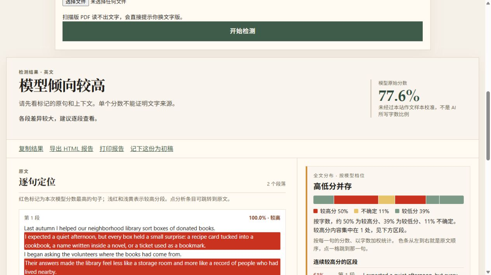

<div align="center">
  
  <h1>Essay AI Detector</h1>
  <p>A local preview for examining model signals in English and Chinese writing.</p>
  <p><strong>Local preview · Not deployed · Scores are not calibrated</strong></p>
  <p><a href="../README.md">简体中文</a> · <a href="#get-started">Get started</a> · <a href="benchmark.md">Evaluation notes</a></p>
</div>



> The screenshot illustrates the interface with demo text. Its score is neither a measured accuracy nor a known ground-truth label.

## What it does

This work-in-progress site runs locally. Paste text or upload a `.txt`, `.docx`, or text-based PDF to preview extracted content and examine an English or Chinese model signal. Mixed-language documents can be scored by language. The results include paragraph and sentence highlights, a document overview, passages to review, and an HTML export. Inference runs on your machine; essay text is not sent to a third-party scoring API.

## How to interpret a result

The output is a **writing-pattern signal**, not the percentage of words written by AI, evidence of misconduct, or a prediction of a school's decision. Display thresholds are provisional. The project does not yet have a representative, labeled evaluation set from which it could publish an accuracy or false-positive rate. Short texts, non-native English writing, edited text, and new domains need careful human review. See the [evaluation notes](benchmark.md).

## Get started

Use Windows, Python 3.11+, and Node.js 20+. Run from the repository root in PowerShell:

```powershell
py -3.12 -m venv .venv-detector
.\.venv-detector\Scripts\python.exe -m pip install -r backend\requirements.txt
npm --prefix frontend ci
.\.venv-detector\Scripts\python.exe experiments\download_model.py
.\打开.bat
```

Open [http://127.0.0.1:5173](http://127.0.0.1:5173) and wait for the English-ready indicator. The Chinese model downloads on first use. Run `停止.bat` when finished. Model weights, virtual environments, private essays, and local evaluation outputs are excluded from this repository.

For development and tests, see [local-development.md](local-development.md). The service is **not deployed online**. Account, usage-limit, and payment features are not implemented.

## License status

No license has yet been assigned to this project's source code. Public visibility does not itself grant reuse rights. Check each model's own license separately.
